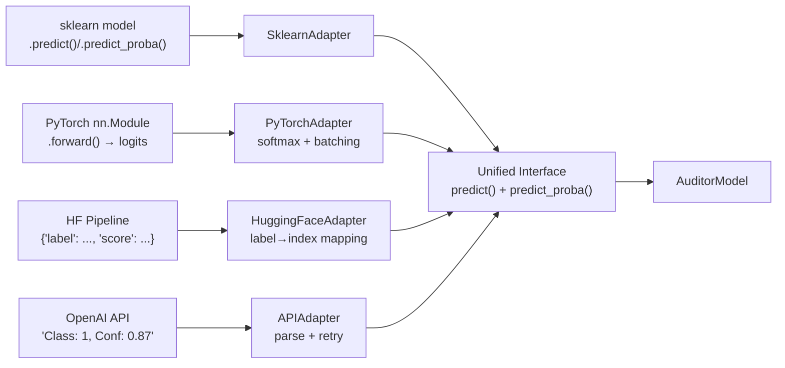
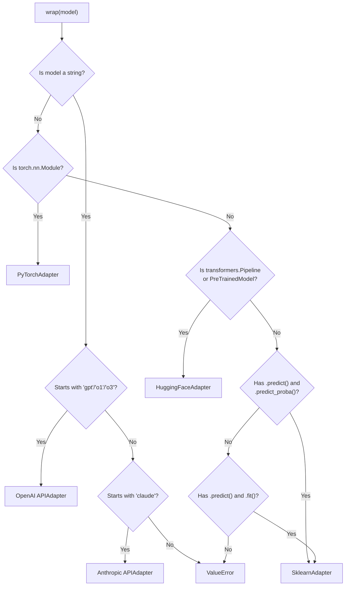

# Understanding AuditorAI — The Complete Guide

## The Problem: AI Gets Things Wrong

Imagine a hospital where an AI reads X-rays. It's right 95% of the time — great! But that 5% error rate means **1 in 20 patients gets a wrong AI-assisted diagnosis**. The doctor trusts the AI, glances at the result, and moves on. The errors slip through.

Now imagine a second AI sitting behind the first one, watching it work. This second AI has learned *when* the first AI tends to be wrong — certain types of images, certain edge cases. When it spots a prediction it doesn't trust, it raises a flag: **"Don't show this one to the doctor. Let the doctor look at the raw image themselves."**

That's AuditorAI. It's the second AI.

```
                    ┌─────────────┐
   Input data ────>│  Your Model  │──── prediction ────┐
                    └─────────────┘                     │
                           │                            │
                      probabilities                     │
                           │                            v
                    ┌─────────────┐              ┌────────────┐
                    │   Auditor   │──── safe? ──>│   Router    │
                    └─────────────┘              └────────────┘
                                                   │        │
                                              SHOW to    SUPPRESS
                                              human      (human decides
                                                          on their own)
```

---

## The Three Components

### 1. Your Model (via Adapter)

This is whatever AI you already have. AuditorAI doesn't care what it is:

| Framework | What wrap() does |
|---|---|
| **sklearn** | Calls `.predict()` and `.predict_proba()` directly |
| **PyTorch** | Runs `model.forward()`, applies softmax to logits, manages GPU/CPU |
| **HuggingFace** | Runs the pipeline or tokenize→forward→softmax |
| **OpenAI/Anthropic** | Calls the API, parses the text response into class + confidence |
| **Custom** | You implement `predict()` and `predict_proba()` yourself |

> [!IMPORTANT]
> The adapter's job is simple: no matter what your model is, make it speak two methods:
> - `predict(X)` → class labels like `[0, 1, 1, 0, 1]`
> - `predict_proba(X)` → probabilities like `[[0.8, 0.2], [0.3, 0.7], ...]`

### 2. The Auditor (the error detector)

The auditor is a **GradientBoosted classifier** that answers one question:

> **"Is the primary model wrong on this input?"**

It outputs a probability: `P(wrong) = 0.0` (definitely right) to `1.0` (definitely wrong).

### 3. The Router (the decision maker)

The router applies a simple rule:

```
if P(wrong) >= threshold:
    SUPPRESS  →  don't show AI's answer, let human decide alone
else:
    SHOW      →  show AI's answer to the human
```

---

## How the Auditor Learns (The Training Process)

This is the most important part to understand. Here's exactly what happens when you call `system.train(X_val, y_val)`:

### Step 1: Get the primary model's predictions on validation data

```python
primary_preds  = adapter.predict(X_val)       # [1, 0, 1, 1, 0, ...]
primary_probas = adapter.predict_proba(X_val)  # [[0.2, 0.8], [0.9, 0.1], ...]
```

### Step 2: Find where the primary model was WRONG

```python
auditor_labels = (primary_preds != y_val)  # [False, True, False, False, True, ...]
#                                             right  WRONG  right  right  WRONG
```

This creates a **binary error mask**: 1 = model was wrong, 0 = model was right.

### Step 3: Build uncertainty features

The auditor doesn't just look at the raw features — it also looks at **how confident** the primary model was. Four signals are extracted from the probability output:

```
Original features:  [x1, x2, x3, ..., xN]     ← your input data

+ confidence:       max(probas)                 ← how sure is the model?
+ predicted_class:  argmax(probas)              ← what did it predict?
+ entropy:          -Σ(p * log(p))              ← how uncertain overall?
+ margin:           top1_prob - top2_prob        ← gap between best and second-best
```

These 4 extra features are **critical**. They let the auditor learn patterns like:
- *"When confidence is high but margin is low, the model is often wrong"*
- *"When entropy is above 0.6 on inputs with feature x3 > 2.0, errors spike"*

### Step 4: Train the auditor classifier

```python
augmented_X = [original_features | confidence | predicted_class | entropy | margin]
auditor_labels = [0, 1, 0, 0, 1, ...]  # 0=correct, 1=wrong

GradientBoostingClassifier.fit(augmented_X, auditor_labels)
```

The auditor now knows: given these features AND this uncertainty pattern, **how likely is it that the primary model is wrong?**

> [!CAUTION]
> **Why validation data, never training data?**
> Your primary model has *memorized* its training data. It's nearly perfect on it. So its errors on training data are random noise, not real failure patterns. The auditor would learn nothing useful. You MUST use held-out data the primary model has never seen.

---

## Data Flow: End to End

Here's exactly what happens when you use the system:

````carousel
### Phase 1: Setup
```python
from auditorai import AuditorSystem, wrap

# You train YOUR model however you want
model = GradientBoostingClassifier().fit(X_train, y_train)

# wrap() auto-detects it's sklearn, returns SklearnAdapter
adapter = wrap(model)
```
The adapter is a thin shell. It just forwards `.predict()` and `.predict_proba()` calls to your model.

<!-- slide -->
### Phase 2: Train the auditor
```python
system = AuditorSystem(adapter)
system.train(X_val, y_val)
```

What happens inside `train()`:
1. Get model predictions on X_val
2. Compare with y_val to find errors
3. Build augmented features (original + 4 uncertainty signals)
4. Train a GradientBoosting classifier to predict errors
5. Create a Router with default threshold 0.5

<!-- slide -->
### Phase 3: Auto-tune threshold
```python
best_tau = system.auto_tune(X_val, y_val, human_accuracy=0.72)
```

What happens:
1. Sweep 17 thresholds from 0.1 to 0.9
2. For each threshold, simulate: "what if we suppress everything above this?"
3. Calculate **joint accuracy** = AI accuracy on shown × (1-rate) + human accuracy × rate
4. Pick the threshold that maximizes accuracy gain over AI-only
5. Apply it to the router

<!-- slide -->
### Phase 4: Predict
```python
result = system.predict(X_test)
```

Returns a dict:
```python
{
  "show_mask":       [True, True, False, True, False],  # show to human
  "suppress_mask":   [False, False, True, False, True],  # hide from human
  "p_wrong":         [0.12, 0.08, 0.73, 0.15, 0.89],   # error probability
  "ai_predictions":  [1, 0, 1, 0, 1],                   # model's predictions
}
```

Sample 3 and 5 have P(wrong) above threshold → suppressed.
The human will decide those two on their own.
````

---

## The Adapter Pattern (Why It's the Core Innovation)

Before the refactor, the system was hardcoded to sklearn:

```python
# OLD: tightly coupled
class AuditorSystem:
    def __init__(self, model_type="random_forest"):
        self.primary_ = PrimaryModel(model_type)  # only sklearn!
```

After the refactor, it accepts anything:

```python
# NEW: universal
class AuditorSystem:
    def __init__(self, adapter: ModelAdapter):
        self.adapter = adapter  # any model, any framework
```

The `ModelAdapter` abstract class defines the contract:

```python
class ModelAdapter(ABC):
    @abstractmethod
    def predict(self, X) -> np.ndarray:      # class labels
        ...
    @abstractmethod
    def predict_proba(self, X) -> np.ndarray: # probability matrix
        ...
```

Every adapter translates its framework's native output into this interface:



---

## File-by-File Map

### Adapters ([auditorai/adapters/](file:///c:/Users/dsatk/.gemini/antigravity/scratch/auditor-model/auditorai/adapters))

| File | Lines | What it does |
|---|---|---|
| [base.py](file:///c:/Users/dsatk/.gemini/antigravity/scratch/auditor-model/auditorai/adapters/base.py) | 170 | `ModelAdapter` ABC with `validate_probas()`. The `wrap()` function auto-detects model type and returns the right adapter. |
| [sklearn_adapter.py](file:///c:/Users/dsatk/.gemini/antigravity/scratch/auditor-model/auditorai/adapters/sklearn_adapter.py) | 100 | Wraps sklearn models. Auto-calibrates models without `predict_proba` using `CalibratedClassifierCV`. |
| [pytorch_adapter.py](file:///c:/Users/dsatk/.gemini/antigravity/scratch/auditor-model/auditorai/adapters/pytorch_adapter.py) | 140 | Wraps `nn.Module`. Auto-detects GPU/MPS/CPU. Runs batched inference. Converts logits→probabilities via softmax. |
| [huggingface_adapter.py](file:///c:/Users/dsatk/.gemini/antigravity/scratch/auditor-model/auditorai/adapters/huggingface_adapter.py) | 170 | Two modes: (1) pass a pipeline object, (2) pass model+tokenizer. Handles label discovery and batched tokenization. |
| [api_adapter.py](file:///c:/Users/dsatk/.gemini/antigravity/scratch/auditor-model/auditorai/adapters/api_adapter.py) | 280 | Wraps OpenAI, Anthropic, or any HTTP endpoint. Uses `ThreadPoolExecutor` for concurrent calls. Exponential backoff on rate limits. Converts `(class, confidence)` → probability vector. |

### Core ([auditorai/core/](file:///c:/Users/dsatk/.gemini/antigravity/scratch/auditor-model/auditorai/core))

| File | Lines | What it does |
|---|---|---|
| [auditor.py](file:///c:/Users/dsatk/.gemini/antigravity/scratch/auditor-model/auditorai/core/auditor.py) | 250 | The error predictor. `_build_features()` creates the 4 uncertainty signals. `fit()` trains on validation errors. `p_wrong()` returns P(model is wrong). `from_errors()` classmethod for offline training from production logs. |
| [router.py](file:///c:/Users/dsatk/.gemini/antigravity/scratch/auditor-model/auditorai/core/router.py) | 160 | Applies threshold to `p_wrong` scores. `sweep_thresholds()` simulates many thresholds. `best_threshold()` picks the optimal one. |
| [system.py](file:///c:/Users/dsatk/.gemini/antigravity/scratch/auditor-model/auditorai/core/system.py) | 195 | Orchestrator. `train()` fits the auditor. `predict()` routes. `auto_tune()` finds best threshold. `audit()` is the one-liner convenience function. |
| [evaluate.py](file:///c:/Users/dsatk/.gemini/antigravity/scratch/auditor-model/auditorai/core/evaluate.py) | 260 | Generates: evaluation report (text), score distribution plot, threshold sweep plot, decision breakdown bar chart. |

### CLI ([auditorai/cli/](file:///c:/Users/dsatk/.gemini/antigravity/scratch/auditor-model/auditorai/cli))

| Command | What it does |
|---|---|
| `auditorai run --data breast_cancer --report` | Loads data → trains sklearn model → trains auditor → auto-tunes → saves → evaluates with plots |
| `auditorai sweep --data breast_cancer --steps 10` | Trains system, then sweeps thresholds and prints a table showing suppression rate vs accuracy gain |
| `auditorai validate --adapter-path outputs/models --data breast_cancer` | Loads a saved auditor and evaluates it on new data |

---

## Key Metrics Explained

When you see the evaluation report:

```
==================================================
  AUDITOR SYSTEM - EVALUATION REPORT
==================================================
  AI-only accuracy:         94.7%      ← model alone, no auditor
  Joint system accuracy:    94.2%      ← model + auditor + human on suppressed
  Accuracy gain:            -0.5%      ← joint - AI-only (negative = auditor hurt)
  Auditor AUROC:            0.512      ← how well auditor separates right/wrong
  Suppression rate:         1.8%       ← fraction of predictions suppressed
  Cases shown:              112        ← human sees AI answer
  Cases suppressed:         2          ← human decides alone
  Auditor precision:        0.0%       ← of suppressed, how many were truly wrong
  Auditor recall:           0.0%       ← of all errors, how many were caught
==================================================
```

| Metric | Good value | What it means |
|---|---|---|
| **AUROC** | > 0.7 | Auditor can distinguish right from wrong predictions |
| **Precision** | > 50% | When we suppress, we're usually right that it was an error |
| **Recall** | > 30% | We catch a meaningful fraction of all errors |
| **Accuracy gain** | > 0% | The joint system beats AI-only |
| **Suppression rate** | 5-30% | We're selective, not suppressing everything |

> [!NOTE]
> On breast_cancer (94.7% baseline), the model makes very few errors, so the auditor has little to learn from. The system shines most when the primary model's error rate is 10-30% — enough errors to learn patterns from.

---

## The `wrap()` Auto-Detection Logic

When you call `wrap(model)`, here's the decision tree:



---

## Lazy Imports: Why Optional Deps Don't Crash

A key design constraint: `import auditorai` must work even if torch, transformers, openai, or anthropic are NOT installed.

Solution: [\_\_init\_\_.py](file:///c:/Users/dsatk/.gemini/antigravity/scratch/auditor-model/auditorai/__init__.py) uses `__getattr__` for lazy loading:

```python
# This ALWAYS works (no torch needed):
from auditorai import AuditorSystem, wrap

# This only fails if you actually TRY to use PyTorchAdapter without torch:
from auditorai import PyTorchAdapter  # lazy import, resolved on access
adapter = PyTorchAdapter(model, n_classes=2)  # ImportError HERE if no torch
```

Each adapter checks for its dependency in `__init__` and raises a helpful error:
```
ImportError: PyTorchAdapter requires torch. Install it with: pip install torch
```

---

## How to Use It (Decision Guide)

```mermaid
graph TD
    A["I have a model"] --> B{"What kind?"}
    B -->|"sklearn / XGBoost /<br/>LightGBM / CatBoost"| C["adapter = wrap(model)"]
    B -->|"PyTorch nn.Module"| D["adapter = wrap(model,<br/>n_classes=N)"]
    B -->|"HF pipeline"| E["adapter = wrap(pipe,<br/>adapter_type='huggingface')"]
    B -->|"OpenAI / Anthropic"| F["adapter = wrap('gpt-4o',<br/>adapter_type='openai',<br/>parse_response=fn,<br/>n_classes=N)"]
    B -->|"Something else"| G["Subclass ModelAdapter<br/>implement predict() +<br/>predict_proba()"]
    C --> H["system = AuditorSystem(adapter)<br/>system.train(X_val, y_val)<br/>system.auto_tune(X_val, y_val)<br/>result = system.predict(X_test)"]
    D --> H
    E --> H
    F --> H
    G --> H
```



---

## Relationship to the Old Code

The old `src/` directory is **completely untouched**. Here's the mapping:

| Old (src/) | New (auditorai/) | What changed |
|---|---|---|
| `src/primary_model.py` → `PrimaryModel` | `auditorai/adapters/sklearn_adapter.py` → `SklearnAdapter` | No longer builds its own model; wraps any existing model |
| `src/auditor_model.py` → `AuditorModel` | `auditorai/core/auditor.py` → `AuditorModel` | Accepts `ModelAdapter` instead of `PrimaryModel`; added `from_errors()` |
| `src/router.py` → `Router` | `auditorai/core/router.py` → `Router` | Type hints changed, logic identical |
| `src/system.py` → `AuditorSystem` | `auditorai/core/system.py` → `AuditorSystem` | No longer creates PrimaryModel internally; receives adapter from user |
| `src/evaluate.py` | `auditorai/core/evaluate.py` | Import paths changed, logic identical |
| `src/utils.py` | `auditorai/utils/data.py` + `auditorai/utils/logging.py` | Split into two files; added `load_any()` smart loader |
| `main.py` | `auditorai/cli/main.py` | Full CLI with subcommands instead of flat script |

> [!TIP]
> The core auditor logic (feature engineering, GradientBoosting training, threshold sweeping) is **exactly the same**. The refactoring only changed the *interface* — how models connect to the auditor — not the *algorithm*.
